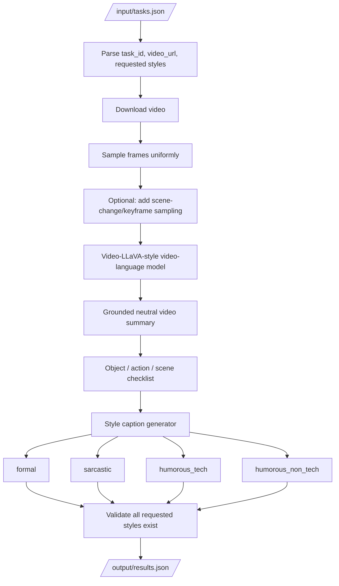
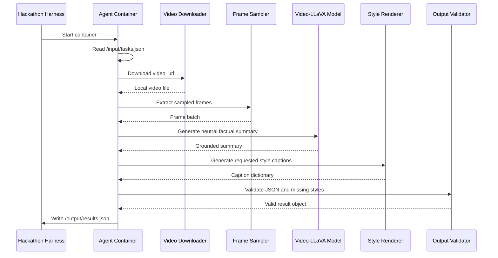
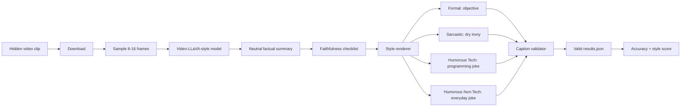

# Video-LLaVA-Style Track 2 Agent
## AMD Developer Hackathon ACT II — Track 2: Video Captioning Agent

**Goal:** Build a robust video captioning agent that reads `/input/tasks.json`, watches each video clip, and writes `/output/results.json` with captions in every requested style.

This plan is optimized for Track 2, where the evaluator scores:
1. **Caption accuracy** — how faithfully the caption reflects the video content.
2. **Style match** — how well the caption matches the requested tone.

The hidden evaluation clips are expected to be **30 seconds to 2 minutes** and cover varied domains such as nature, urban scenes, animals, people, sports, food, weather, and technology.

---

## 1. Why Video-LLaVA-Style Is the Best Practical Approach

A Video-LLaVA-style system is better suited to this challenge than a classical video captioning model because Track 2 is not only asking for one neutral caption. It asks for multiple caption styles:

- `formal`
- `sarcastic`
- `humorous_tech`
- `humorous_non_tech`

Classical captioning models such as Vid2Seq, SwinBERT, or PDVC are strong for content grounding, but they are less natural for prompt-controlled style generation. Video-LLaVA-style video-language models are more practical because they support instruction-following prompts directly.

**Main idea:**  
Use a video-language model once to understand the clip, extract a neutral semantic summary, then generate four style-specific captions from that grounded summary.

---

## 2. High-Level System Architecture



---

## 3. Two-Stage Caption Strategy

The safest strategy is not to ask the model to generate all four captions directly from the video in one pass. That can cause style captions to drift away from the actual content.

Instead, use two stages.

### Stage A — Content Grounding

Prompt the video model to produce a neutral, factual description.

Example prompt:

```text
You are a precise video understanding model.

Describe the video in 2 concise sentences.
Mention only visible content.
Include:
- main subject
- setting
- key actions
- notable objects
- scene mood
Do not invent details.
Do not be funny yet.
```

Expected output:

```text
The video shows an orange kitten sitting among green plants in a garden. The kitten looks around calmly while surrounded by leaves and natural light.
```

### Stage B — Style Rendering

Use the grounded summary as the source of truth and generate style-specific captions.

Example prompt:

```text
Rewrite the following factual video summary as a single caption.

Rules:
- Preserve all factual content.
- Do not add new objects, people, locations, or actions.
- Keep it under 25 words.
- Match this style exactly: {style}

Factual summary:
{neutral_summary}
```

---

## 4. Style Prompt Templates

### 4.1 Formal

```text
Style: formal

Write a professional, objective, factual video caption.
Avoid jokes, sarcasm, slang, and exaggeration.
Keep the caption concise and accurate.
```

Example:

```text
An orange kitten rests among green garden foliage, calmly observing its surroundings in natural daylight.
```

### 4.2 Sarcastic

```text
Style: sarcastic

Write a dry, lightly ironic caption.
Keep it safe and not mean-spirited.
Do not distort the facts.
Avoid overexplaining the joke.
```

Example:

```text
An orange kitten bravely supervises the garden, because clearly the plants were getting out of control.
```

### 4.3 Humorous Tech

```text
Style: humorous_tech

Write a funny caption using technology or programming references.
Use light references such as debugging, loading, kernel, cache, model, update, server, or deployment.
Do not use obscure jargon.
Do not add false visual details.
```

Example:

```text
Orange kitten detected in garden mode, calmly running the foliage inspection script with maximum cuteness enabled.
```

### 4.4 Humorous Non-Tech

```text
Style: humorous_non_tech

Write a funny everyday caption with no programming or technical jargon.
Use simple humor.
Do not include tech words.
Do not distort the facts.
```

Example:

```text
An orange kitten sits in the garden like it owns the place, and honestly, the plants seem fine with it.
```

---

## 5. Recommended Model Stack

### Primary Model

Use a Video-LLaVA-style model:

- **Video-LLaVA**
- **LLaVA-NeXT-Video**
- **Video-ChatGPT-style model**
- Any stronger video-language API model if allowed by your credentials and runtime

Track 2 has no model restriction, so you can use any model/API/framework inside the container, but the system must finish within the time limit and output valid JSON.

### Practical Default

For a fast hackathon implementation:

```text
Primary path:
Video URL → frame sampling → video-language model → neutral summary → style captions
```

### Stronger path:

```text
Video URL → frame sampling + scene-change frames → video-language model → neutral summary
          → self-check factual claims → generate 4 style captions → JSON validation
```

---

## 6. Frame Sampling Strategy

The hidden clips are 30 seconds to 2 minutes, so processing every frame is wasteful.

Recommended default:

```text
Sample 8–16 frames per video uniformly.
```

Better version:

```text
Sample:
- 8 uniform frames
- 4 scene-change/keyframes
- 1 first frame
- 1 last frame
```

Then deduplicate visually similar frames.

### Why this matters

Uniform sampling gives temporal coverage. Scene-change sampling catches sudden events. First and last frames help summarize beginning and ending context.

---

## 7. Runtime Design

The system should generate only one video understanding pass per clip, not four separate video passes.

Bad:

```text
Run video model separately for formal
Run video model separately for sarcastic
Run video model separately for humorous_tech
Run video model separately for humorous_non_tech
```

Better:

```text
Run video model once → neutral summary → generate all styles from summary
```

This reduces cost and improves consistency.

---

## 8. Output Format

Your container must write:

```json
[
  {
    "task_id": "v1",
    "captions": {
      "formal": "...",
      "sarcastic": "...",
      "humorous_tech": "...",
      "humorous_non_tech": "..."
    }
  }
]
```

If the input only requests some styles, output exactly those requested styles.

Example:

```json
[
  {
    "task_id": "v1",
    "captions": {
      "formal": "An orange kitten rests among green garden foliage, calmly observing its surroundings in natural daylight.",
      "sarcastic": "An orange kitten bravely supervises the garden, because clearly the plants were getting out of control.",
      "humorous_tech": "Orange kitten detected in garden mode, calmly running the foliage inspection script with maximum cuteness enabled.",
      "humorous_non_tech": "An orange kitten sits in the garden like it owns the place, and honestly, the plants seem fine with it."
    }
  }
]
```

---

## 9. Agent Workflow



---

## 10. Suggested Repository Structure

```text
track2-video-caption-agent/
├── Dockerfile
├── requirements.txt
├── README.md
├── src/
│   ├── main.py
│   ├── io_utils.py
│   ├── video_download.py
│   ├── frame_sampler.py
│   ├── video_model.py
│   ├── style_renderer.py
│   ├── validator.py
│   └── prompts.py
├── tests/
│   ├── test_format.py
│   └── test_styles.py
└── examples/
    ├── tasks.json
    └── results.json
```

---

## 11. Pseudocode

```python
def main():
    tasks = read_json("/input/tasks.json")
    results = []

    for task in tasks:
        task_id = task["task_id"]
        video_url = task["video_url"]
        styles = task["styles"]

        video_path = download_video(video_url)
        frames = sample_video_frames(video_path, num_uniform=12, add_keyframes=True)

        neutral_summary = video_llava_describe(frames)

        captions = {}
        for style in styles:
            captions[style] = render_style_caption(
                neutral_summary=neutral_summary,
                style=style
            )

        captions = validate_and_repair_captions(
            captions=captions,
            required_styles=styles,
            neutral_summary=neutral_summary
        )

        results.append({
            "task_id": task_id,
            "captions": captions
        })

    write_json("/output/results.json", results)
```

---

## 12. Prompt Pack

### 12.1 Neutral Summary Prompt

```text
You are a careful video captioning model.

Task:
Describe the video accurately in 1-2 sentences.

Rules:
- Mention only visible content.
- Include the main subject, setting, and action.
- Do not guess identities, brands, locations, or emotions unless visually clear.
- Do not mention camera details unless important.
- Do not be humorous yet.
- Keep it concise.
```

### 12.2 Factual Checklist Prompt

```text
From the video summary below, extract a factual checklist.

Return JSON only:
{
  "subjects": [],
  "setting": "",
  "actions": [],
  "objects": [],
  "mood": "",
  "avoid_claims": []
}

Summary:
{neutral_summary}
```

### 12.3 Style Rendering Prompt

```text
You are writing a video caption.

Use this factual summary as the only source of truth:
{neutral_summary}

Write one caption in this style:
{style_definition}

Rules:
- One sentence only.
- 10 to 25 words.
- Preserve the visible facts.
- Do not add new subjects, actions, objects, locations, or events.
- Output the caption only.
```

### 12.4 Caption Repair Prompt

```text
Check whether this caption stays faithful to the factual summary.

Factual summary:
{neutral_summary}

Caption:
{caption}

If faithful, return the caption unchanged.
If it adds unsupported details, rewrite it to remove them.
Keep the requested style: {style}
Return only the final caption.
```

---

## 13. Guardrails Against Hallucination

Use these rules before writing the final JSON:

1. Every caption must mention the same core subject as the neutral summary.
2. Every caption must preserve the same setting.
3. Humor can change wording, not facts.
4. Sarcasm must be light and not hostile.
5. `humorous_tech` must contain a tech/programming reference.
6. `humorous_non_tech` must not contain technical jargon.
7. If uncertain, prefer a generic factual caption over an invented specific caption.
8. Never leave a requested style missing.

---

## 14. Scoring Optimization

### Accuracy Boosters

- Use neutral summary first.
- Use frame sampling across the full video.
- Avoid over-specific claims.
- Mention visible objects and actions.
- Validate captions against the neutral summary.

### Style Boosters

- Use style-specific prompt templates.
- Keep each caption short.
- For `humorous_tech`, include accessible tech words.
- For `sarcastic`, use light irony.
- For `formal`, remove all jokes.
- For `humorous_non_tech`, make it funny without tech terms.

---

## 15. Common Failure Modes

| Failure mode | Why it hurts | Fix |
|---|---|---|
| Hallucinated object | Lowers caption accuracy | Use neutral summary as source of truth |
| Same caption for every style | Lowers style match | Use style templates |
| Too long caption | Judge may penalize style clarity | Keep 10–25 words |
| Missing requested style | Scores zero for that style | Validate keys before saving |
| Too many model calls | Runtime risk | One video pass, multiple text generations |
| Weak temporal coverage | Misses important events | Uniform + keyframe sampling |
| Overly edgy sarcasm | Style mismatch | Keep sarcasm dry and mild |

---

## 16. Minimal Docker Plan

### Dockerfile skeleton

```dockerfile
FROM python:3.10-slim

WORKDIR /app

RUN apt-get update && apt-get install -y \
    ffmpeg \
    git \
    && rm -rf /var/lib/apt/lists/*

COPY requirements.txt .
RUN pip install --no-cache-dir -r requirements.txt

COPY src/ ./src/

CMD ["python", "-m", "src.main"]
```

### requirements.txt idea

```text
torch
transformers
accelerate
opencv-python-headless
decord
pillow
numpy
requests
```

If using an API model, keep the image lighter:

```text
opencv-python-headless
decord
pillow
numpy
requests
openai
```

---

## 17. Local Testing

Create `examples/tasks.json`:

```json
[
  {
    "task_id": "v1",
    "video_url": "https://storage.googleapis.com/amd-hackathon-clips/1860079-uhd_2560_1440_25fps.mp4",
    "styles": ["formal", "sarcastic", "humorous_tech", "humorous_non_tech"]
  }
]
```

Run locally:

```bash
mkdir -p input output
cp examples/tasks.json input/tasks.json

docker buildx build --platform linux/amd64 -t track2-agent:latest .
docker run --rm \
  -v "$PWD/input:/input" \
  -v "$PWD/output:/output" \
  track2-agent:latest
```

Check:

```bash
cat output/results.json | python -m json.tool
```

---

## 18. Best Submission Strategy

### Recommended final strategy

```text
Use Video-LLaVA-style video understanding + two-stage caption generation + JSON validator.
```

### Why this should score well

- Good caption accuracy because all styles are grounded in one factual summary.
- Good style match because each caption is generated with a dedicated style prompt.
- Lower runtime because the video model is called once per clip.
- Lower risk because JSON is validated before output.
- Better generalization because the pipeline does not depend on hardcoded example clips.

---

## 19. Mermaid Summary: Winning Pipeline



---

## 20. Final Recommendation

Use the Video-LLaVA-style approach as the main system.

Do **not** directly generate four independent captions from the video. Instead:

1. Extract video frames.
2. Generate one neutral factual summary.
3. Generate requested style captions from that summary.
4. Validate style keys and factual consistency.
5. Save valid JSON.

This design best matches the challenge scoring because it separates the two things the judge cares about: **what happened** and **how the caption sounds**.

---

## References

- AMD Developer Hackathon ACT II Participant Guide, Track 2: Video Captioning Agent.
- Video-LLaVA GitHub: https://github.com/PKU-YuanGroup/Video-LLaVA
- Video-LLaVA paper: https://arxiv.org/abs/2311.10122
- LLaVA-NeXT GitHub: https://github.com/LLaVA-VL/LLaVA-NeXT
- Vid2Seq project: https://antoyang.github.io/vid2seq.html
- Vid2Seq GitHub: https://github.com/google-research/scenic/tree/main/scenic/projects/vid2seq
